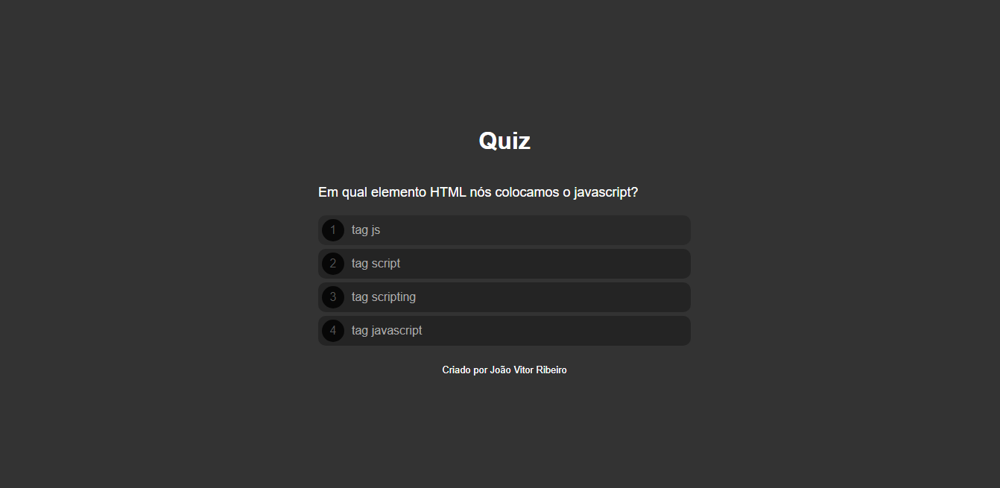
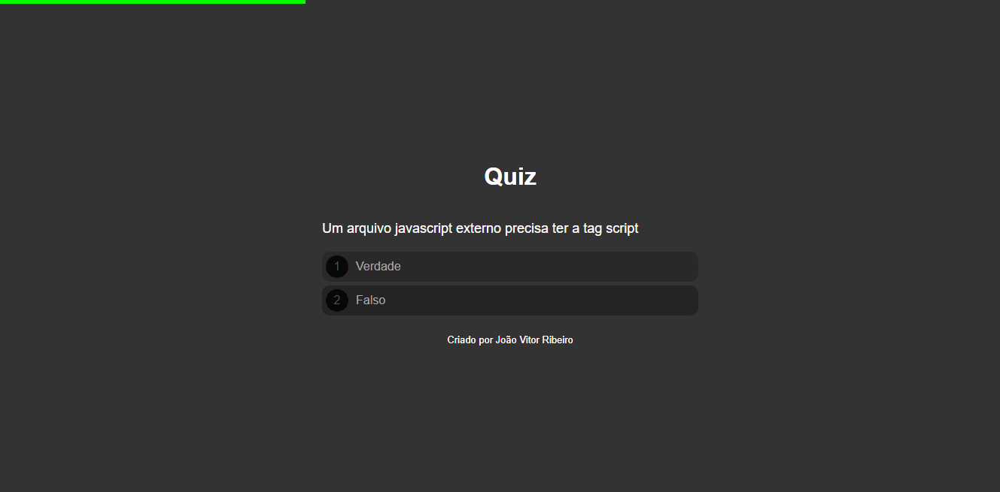

# 💻  Sobre o Projeto:
Este é um projeto desenvolvido durante o módulo de Java script do curso oferecido pela B7web, com o objetivo de evoluir a construção individual do aluno. Foi desenvolvido um quiz com 10 perguntas para o usuário, na página foram utilizandas apena as tecnologia HTML5,CSS3 e Java Script.
 
# 🛠 Tecnologias utilizadas:

    <ul>
        <li>HTML</li>
        <li>CSS</li>
        <li>JavaScript</li>
    </ul>

# ⚙️ Funcionalidades:
<li>Na primeira seção da página, os usuários serão apresentados a 10 questões objetivas de múltipla-escolha,podendo escolher só uma resposta.</li>
<li>Após escolher as respotas das 10 perguntas, irá aparecer o resultado com um aviso de quantas perguntas(em porcentagem) o usuário acertou, além disso, haverá um botão de refazer o quiz.</li>
<li>Além de que, conforme as questões são respondidas,será preenchido uma barra de progresso,</li>

# 🎨 Pré-visualização :
## Apresentação das Pizzas

## Barra de progresso em verde:

## Resultado:

# 🦸 Autor:

 
<a href="https://www.linkedin.com/in/jo%C3%A3o-vitor-ribeiro-dias-339a56258/" target="_blank">João Vitor RIbeiro Dias</a>